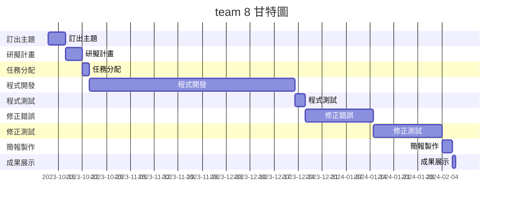
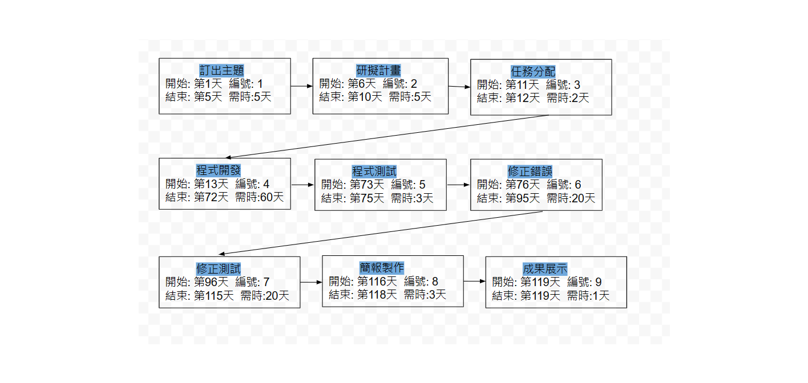
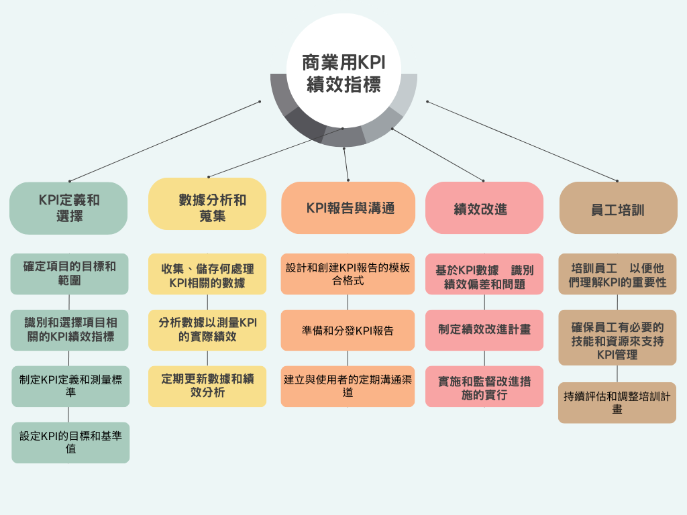
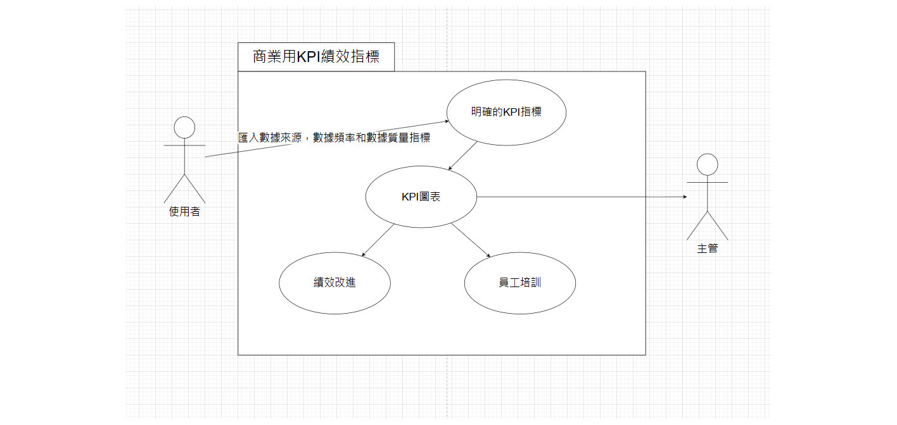
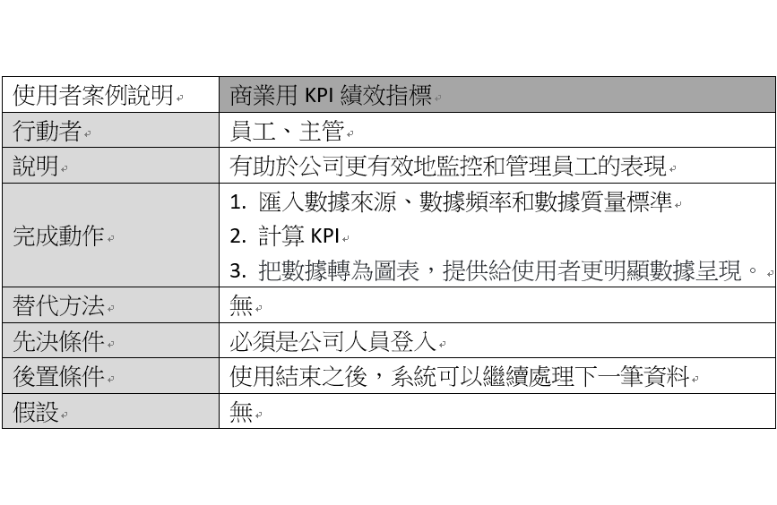
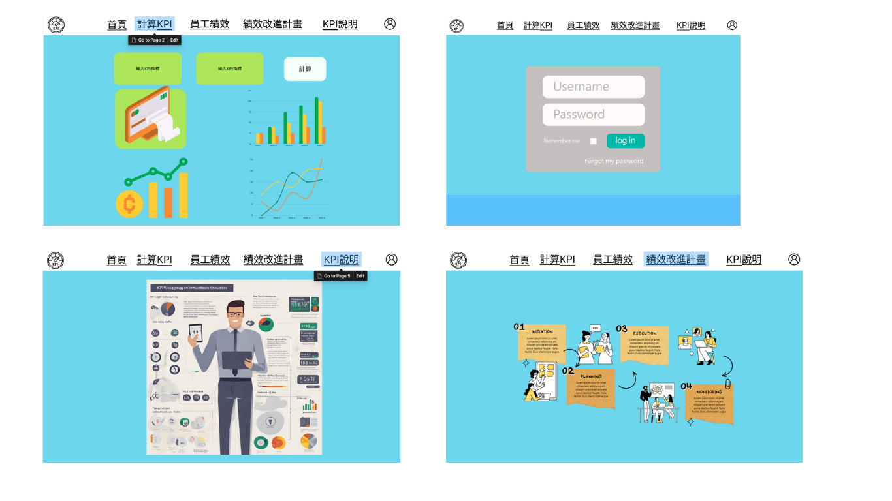
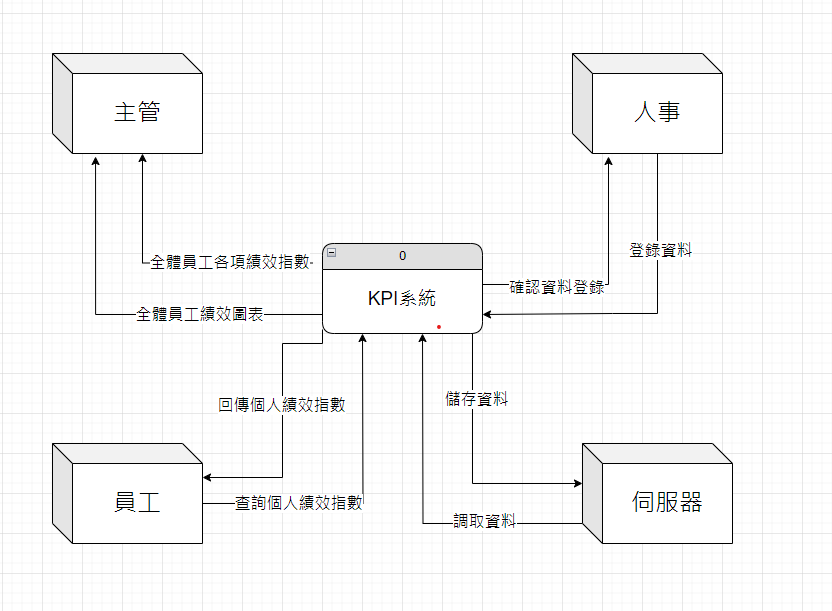
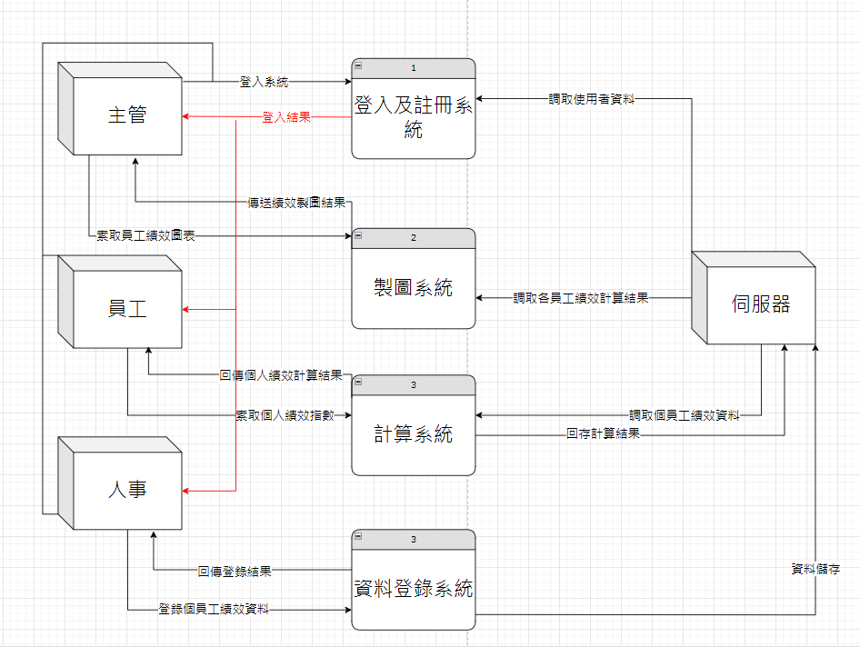

## Team 8
# 主題:商業用KPI績效指標
| **職位** | **姓名** | **學號** | **工作分配**|
| :---     |  :---       |  :---   | :---      |
|   組長   | 李彥鋒   | C110118252  |     文書處裡      |
|   組員   | 張皓博   | C110118212  |     程式製作、測試      |
|   組員   | 白宇廷   | C110118250  |     程式製作、測試     |
|   組員   | 吳孟翰   | C110118255  |     程式製作、測試     |
|   組員   | 黃弘穎   | C110118235  |     程式製作、測試     |

### 簡介:這個商用KPI績效指標網站旨在提供公司主管和員工一個便捷的平台，以追蹤和評估員工的績效表現。
主要功能包括員工達標數量、比賽和證照等加分項目、個人目標設定、績效評估報告，以及圖表和視覺化工
具呈現。這個網站旨在提供一個直觀、全面的解決方案，有助於公司更有效地監控和管理員工的表現。

## 甘特圖

## Pert圖

## 關鍵路徑
1 -> 2 -> 3-> 4 -> 5 -> 6 -> 7 -> 8 -> 9

|**功能性需求**||
|:--:|:--|
|1|簡單清楚的使用者介面，讓操作的人淺顯易懂。|
|2|有明確清楚的績效指標提供給使用者作為計算KPI的基礎。|
|3|能把數據轉為圖表，提供給使用者更明顯數據呈現。|

|**非功能性需求**||
|:--:|:--|
|1|要有足夠安全的系統讓公司的數據不被外流。|
|2|因應每個產業不同的需求，要有彈性的績效指標提供給使用者作使用。|
|3|做為商用地工具，需要有良好的穩定性。|

## 功能分解圖

## 需求分析
|**商用KPI績效指標的需求分析**||
|:--:|:--|
|1.明確的KPI指標|使用者最關心的KPI，如銷售額、利潤率、客戶滿意度等。|
|2.數據需求|確定數據收集的需求，包括數據來源、數據頻率和數據質量標準。|
|3.報告和可視化需求|定義報告格式和可視化方式，以便呈現KPI的數據。|
|4.績效改進需求|確定績效改進和行動計劃的需求，包括責任分配和時間表。|
|5.需求確認|與關鍵利益相關者共同確認所有需求，確保一致性和準確性。|

## 使用者案例圖

## 使用者案例說明圖

## 使用Figma繪製動態模擬畫面

https://www.figma.com/community/file/1298621726970268359/kpi

## 系統環境圖 (DFD)

## DFD 圖0

